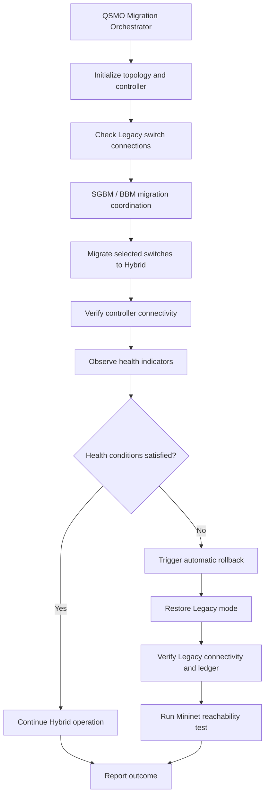

# Quantum Safe Migration Orchestrator (QSMO)

### Hybrid SDN Controller Migration with SGBM, BBM, Health Monitoring, and Automatic Recovery

[](https://ubuntu.com/)
[](http://mininet.org/)
[](https://github.com/faucetsdn/ryu)

QSMO Migration-Orchestrator is a research and demonstration system for coordinating Software-Defined Networking (SDN) controller migration between a **Legacy** mode and a **Hybrid** mode. It combines migration coordination, controller-connection verification, health monitoring, rollback decisions, and network reachability validation in an emulated environment.

> **Demonstration note:** The integrated rollback scenario uses deliberately injected synthetic health values to exercise recovery. These values are test inputs, not measurements from a production network.

---

## Contents

- [Project at a glance](#project-at-a-glance)
- [Capabilities](#capabilities)
- [Architecture and workflow](#architecture-and-workflow)
- [Demonstration environment](#demonstration-environment)
- [Repository layout](#repository-layout)
- [Prerequisites](#prerequisites)
- [Setup](#setup)
- [Run the integrated demonstration](#run-the-integrated-demonstration)
- [Validate network connectivity](#validate-network-connectivity)
- [Run tests](#run-tests)
- [Demonstrated results](#demonstrated-results)
- [Monitoring scenario](#monitoring-scenario)
- [Logs and troubleshooting](#logs-and-troubleshooting)
- [Limitations](#limitations)
- [Future work](#future-work)

## Project at a glance

| Item | Description |
|---|---|
| Domain | Software-Defined Networking (SDN) |
| Main purpose | Coordinated controller migration and recovery |
| Migration workflow | SGBM and BBM components |
| Network environment | Mininet and Open vSwitch |
| Controller framework | OS-Ken |
| Demonstrated topology | 7 switches and 8 hosts |
| Demonstrated migration targets | `s1`, `s2`, and `s5` |
| Validation | Controller-state checks, migration ledger, and Mininet `pingall` |

## Capabilities

- **Migration coordination:** Coordinates selected switch migration through the SGBM/BBM workflow.
- **Hybrid migration:** Moves selected switches from Legacy mode to Hybrid mode.
- **Connection verification:** Checks switch/controller connectivity and migration verification samples.
- **Health monitoring:** Evaluates latency and failure-rate indicators against configured thresholds.
- **Automatic rollback:** Reverts a migrated switch when the configured demonstration health conditions are violated.
- **Outcome tracking:** Records migration and rollback outcomes in the migration ledger.
- **Network validation:** Uses Mininet host reachability tests to check connectivity after recovery.

## Architecture and workflow



## Demonstration environment

The integrated demonstration was run in an Ubuntu virtual machine with:

- Python 3
- Mininet
- Open vSwitch (OVS)
- OS-Ken
- Git

The default demonstration topology contains seven switches and eight hosts. The launcher may use elevated privileges for network emulation and controller operations.

## Run on any topology (edit only `network/topo.py`)

`network/topo.py` is the single place the topology is defined. Everything else (coverage model, SGBM optimizer, monitor, Hybrid migration, certificates, port assignments, flow definitions, live tests, console API) adapts automatically.

```bash
# pick a built-in shape without editing anything ...
sudo python3 network/topo.py --topology ring:6      # default | line:N | ring:N | star:N | mesh:N | tree:DEPTH:FANOUT
# ... or edit the TOPOLOGY = ... line in network/topo.py (or write your own switches/hosts/links dict)
```

After the switches are up, `topo.py` runs `./sync_topology.sh`, which regenerates `network/flows_config.json`, the port registry + `docs/PORTS.md`, and the per-switch Hybrid certificates (incremental: only missing certs are issued). Then start the controller / demo as usual (`./run_qsmo_demo.sh`). Set `QSMO_AUTO_SYNC=0` to skip the sync and run it by hand.

Rules enforced before Mininet starts: unique non-zero 16-hex dpids, connected switch graph, hosts attached to existing switches. STP is enabled only when the topology contains a loop.

Offline verification (no Mininet needed): `python3 tests/test_any_topology.py` runs the real coverage model and SGBM optimizer over 17 topology shapes; `python3 -m optimizer.run_experiment --topology ring:6` runs the budget sweep on one.

## QSMO Console API

`console/` is a FastAPI backend (no authentication) for a management dashboard: `pip install -r console/requirements.txt && uvicorn console.main:app --port 8000`, then open `/docs`. See `console/ENDPOINTS.md`.

## Repository layout

```text
Migration-Orchestrator/
├── controller/          # SDN controller application and switch behavior
├── network/             # topo.py (the only file to edit per topology), coverage model, flow generator
├── migration/           # Migration workflow, port registry, certificates, monitoring
├── optimizer/           # SGBM optimizer, capability tracker, experiments
├── console/             # FastAPI management-console API (+ ENDPOINTS.md)
├── tests/               # Integration, monitoring and any-topology tests
├── sync_topology.sh     # Regenerates flows / ports / Hybrid certs for the running topology
├── README.md            # Project documentation
└── run_qsmo_demo.sh     # Integrated demonstration launcher
```

Other project files may be present. The descriptions above identify the principal areas used by the documented workflow.

## Prerequisites

Install or configure the following in a supported Ubuntu environment:

- Git and Python 3
- Mininet
- Open vSwitch
- OS-Ken and the Python dependencies required by this repository

Mininet and Open vSwitch require system-level configuration and appropriate privileges. Use the installation instructions appropriate to your Ubuntu release and lab environment.

## Setup

### 1. Clone the repository

```bash
git clone https://github.com/Ruvanthi1075/Migration-Orchestrator.git
cd Migration-Orchestrator
```

### 2. Check out the demonstration branch

```bash
git checkout monitor
```

### 3. Create a Python virtual environment

```bash
python3 -m venv .venv
source .venv/bin/activate
```

If a `requirements.txt` is present in the checked-out version, install its dependencies:

```bash
python -m pip install --upgrade pip
python -m pip install -r requirements.txt
```

If no dependency file is provided, install the project's required Python packages using the versions configured for your lab environment. Ensure OS-Ken, Mininet, and OVS are available before running the integrated scenario.

## Run the integrated demonstration

From the repository root:

```bash
chmod +x run_qsmo_demo.sh
./run_qsmo_demo.sh
```

The launcher starts the integrated demonstration and may request a password for privileged networking operations. Review the terminal output and wait for the final status.

A successful integrated run includes the marker:

```text
INTEGRATED LIVE SGBM + MONITOR + AUTOMATIC ROLLBACK PASSED
```

The exact log details and results can vary by environment.

## Validate network connectivity

When the Mininet command-line interface is available, run:

```text
mininet> pingall
```

A successful run should report no dropped packets for the tested topology. To leave the Mininet CLI:

```text
mininet> exit
```

## Run tests

The repository includes tests for monitoring, migration, rollback, and topology integration under `tests/`.

Topology-independence check (offline): `python3 tests/test_any_topology.py`.

A general test invocation is:

```bash
python3 -m pytest tests/
```

Some integration tests may require Mininet, OVS, OS-Ken, elevated privileges, or a configured network environment. If a test fails because a system dependency is missing, install or configure that dependency before interpreting the result as a code failure.

## Demonstrated results

In the recorded integrated demonstration:

- Initial controller preflight reported **7/7 switches connected**.
- Switches `s1`, `s2`, and `s5` migrated to Hybrid mode.
- Hybrid controller connectivity and verification samples completed for the selected switches.
- The configured health scenario triggered automatic rollback.
- The selected switches returned to Legacy mode and their controller connections were verified.
- The migration ledger recorded migration and rollback outcomes.
- Mininet `pingall` reported **56/56 responses received (0% packet loss)**.

These are results from a demonstrated run, not a guarantee that every environment or execution will produce identical results.

## Monitoring scenario

The integrated rollback demonstration deliberately injects synthetic values to exercise the recovery path:

| Indicator | Demonstration input | Configured threshold |
|---|---:|---:|
| Latency | 1000 ms | 100 ms |
| Failure rate | 0.50 | 0.10 |

Because the inputs are intentionally outside the configured thresholds, the scenario exercises the automatic rollback behavior. **Do not describe these injected values as live production measurements.**

## Logs and troubleshooting

The launcher creates a timestamped log in the user's home directory. Use the log to review controller startup, switch connections, migration events, health observations, rollback decisions, and final checks.

Useful checks:

```bash
git status
python3 --version
which mn
which ovs-vsctl
```

If the demo cannot start, check that Mininet and OVS are installed and available, that the launcher is being run from the repository root, and that required privileges are available. Avoid deleting project files or changing controller configuration until the relevant error in the log has been identified.

## Limitations

- The documented workflow is demonstrated in an emulated Mininet environment.
- The rollback demonstration uses synthetic health inputs.
- Results depend on software versions, system configuration, privileges, and runtime conditions.
- Emulation results alone do not establish production-network performance, scalability, or security.

## Future work

- Add a pinned, reproducible dependency specification.
- Expand automated tests across additional topology sizes and failure cases.
- Export structured experiment results for easier comparison.
- Evaluate monitoring with realistic measured traffic and clearly documented test conditions.
- Improve setup checks and troubleshooting guidance.

## Disclaimer

This project is intended for research, development, and controlled demonstration. Review and validate configuration, dependencies, and operational behavior before using any component in a real network.
