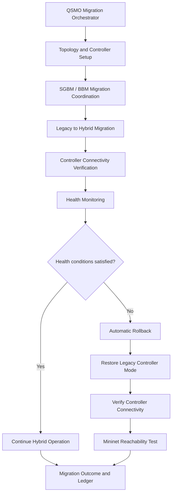

# QSMO Migration-Orchestrator

### Hybrid Controller Migration with SGBM, BBM, Health Monitoring, and Automatic Recovery

QSMO Migration-Orchestrator is a research and demonstration project for orchestrating SDN controller migration between a Legacy controller mode and a Hybrid controller mode.

The project demonstrates migration coordination, controller connectivity verification, health monitoring, rollback decisions, and post-recovery network reachability checks.

## Overview

The integrated demonstration combines:

- **SGBM and BBM:** Migration coordination and hybrid migration workflow.
- **Hybrid controller migration:** Migration of selected switches from Legacy to Hybrid mode.
- **Controller connectivity verification:** Checks that switches connect to the expected controller endpoint.
- **Health monitoring:** Observes migration health indicators.
- **Automatic rollback:** Reverts migrated switches when configured health conditions are violated.
- **Migration ledger:** Records migration and rollback outcomes.
- **Mininet validation:** Checks end-to-end host reachability after recovery.

## Demonstrated Environment

The integrated demonstration uses:

- Ubuntu Linux virtual machine
- Mininet network emulation
- Open vSwitch (OVS)
- OS-Ken SDN controller
- Python
- Linux shell scripts

The demonstrated topology contains 7 switches and 8 hosts.

## Key Demonstration Features

### Hybrid migration

The demonstration migrates switches s1, s2, and s5 into Hybrid mode.

The migration workflow checks controller connectivity and performs verification samples before considering a cutover successful.

### Health monitoring

The monitoring workflow evaluates latency and failure-rate indicators against configured thresholds.

### Automatic recovery

When the demonstration's health conditions trigger a rollback, the orchestrator returns the selected switches to Legacy mode and verifies their controller connectivity.

### Network validation

Mininet's `pingall` command is used to validate host-to-host reachability after rollback.

## Architecture and Workflow



## Repository Structure

The repository includes the following principal components:

| Path | Purpose |
|---|---|
| `controller/` | SDN controller application and switch behavior |
| `migration/` | Migration coordination, migration logic, and monitoring |
| `optimizer/` | Topology optimization components |
| `tests/` | Integration and monitoring tests |
| `run_qsmo_demo.sh` | Integrated demonstration launcher |
| `README.md` | Project documentation |

Additional scripts and modules may be present in the repository.

## Prerequisites

The demonstration is intended for an Ubuntu environment with:

- Python 3
- Git
- Mininet
- Open vSwitch
- OS-Ken
- Required Python packages for the project

Mininet and Open vSwitch require appropriate system privileges and installation.

## Getting Started

### 1. Clone the repository

```bash
git clone <YOUR_REPOSITORY_URL>
cd Migration-Orchestrator
```

Replace `<YOUR_REPOSITORY_URL>` with the repository's Git URL.

### 2. Switch to the monitor branch

```bash
git checkout monitor
```

### 3. Create and activate a Python virtual environment

```bash
python3 -m venv .venv
source .venv/bin/activate
```

If the project has a `requirements.txt` file, install its dependencies:

```bash
pip install -r requirements.txt
```

Install any system-level dependencies required by Mininet, Open vSwitch, and OS-Ken according to the project's environment.

## Running the Integrated Demonstration

From the repository root:

```bash
chmod +x run_qsmo_demo.sh
./run_qsmo_demo.sh
```

The launcher prepares and starts the integrated demonstration. It may request elevated privileges for networking and controller operations.

Follow the terminal output and wait for the demonstration's final result.

The successful integrated run reports:

```text
INTEGRATED LIVE SGBM + MONITOR + AUTOMATIC ROLLBACK PASSED
```

The exact output depends on the environment and test execution.

## Demonstration Workflow

The integrated workflow includes:

1. Initialize the Mininet topology and controller application.
2. Check the initial Legacy controller connections.
3. Migrate the selected switches into Hybrid mode.
4. Verify Hybrid controller connectivity.
5. Run health-monitoring observations.
6. Trigger automatic rollback when the configured demonstration conditions are met.
7. Verify that the switches return to Legacy mode.
8. Inspect migration outcomes and the migration ledger.
9. Validate host reachability using Mininet.

## Network Connectivity Test

When the Mininet CLI is available, run:

```text
mininet> pingall
```

A successful demonstration should report no dropped packets for the tested topology.

To leave the Mininet CLI:

```text
mininet> exit
```

## Monitoring and Test Data

**Important:** The integrated rollback demonstration uses deliberately injected synthetic health metrics to exercise the recovery workflow.

The demonstrated values include:

- Latency: 1000 ms
- Failure rate: 0.50
- Configured latency threshold: 100 ms
- Configured failure-rate threshold: 0.10

These are controlled demonstration inputs, not claims of measurements from a production network or live physical infrastructure.

## Testing

The repository contains integration and monitoring tests under `tests/`.

Examples of test areas include:

- Live SGBM migration workflow
- Multi-switch migration
- BBM rollback behavior
- Live monitoring observations
- Topology optimization integration

Run tests from the repository root using the project's test runner and the test modules available in `tests/`.

For example:

```bash
python3 -m pytest tests/
```

Some integration tests may require Mininet, Open vSwitch, OS-Ken, elevated privileges, or a configured test environment.

## Results and Validation

The integrated demonstration has previously completed the following checks:

- 7 of 7 switches connected during initial preflight.
- Switches s1, s2, and s5 migrated to Hybrid mode.
- Hybrid connectivity and verification samples completed.
- Health conditions triggered automatic rollback.
- The selected switches returned to Legacy mode.
- Migration ledger recorded successful migration and rollback outcomes.
- Mininet reported 56 of 56 ping responses received, with 0% packet loss.

These results describe the demonstrated test run and are not a guarantee for every machine or execution.

## Logs

The demonstration launcher writes a timestamped log under the user's home directory.

Review the log for:

- Controller startup
- Switch connection status
- Migration events
- Monitoring observations
- Rollback decisions
- Final verification results

## Limitations

- The project is demonstrated in an emulated Mininet environment.
- Synthetic monitoring inputs are used to exercise automatic recovery.
- Results depend on installed dependencies, system configuration, and runtime conditions.
- Successful emulation does not by itself establish production-network performance or security.

## Future Improvements

- Expand automated test coverage.
- Add configurable monitoring profiles.
- Improve structured logging and experiment result export.
- Evaluate the workflow with additional topology sizes and failure scenarios.
- Validate behavior under more realistic network measurements.

## Disclaimer

This project is intended for research, development, and controlled demonstration. Validate configuration and operational behavior before using it in any real network.

---
